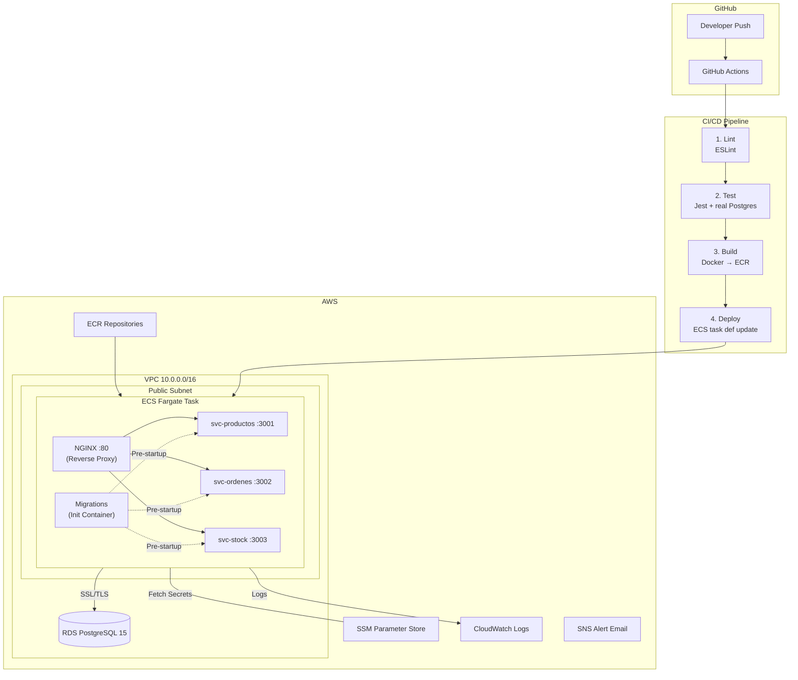
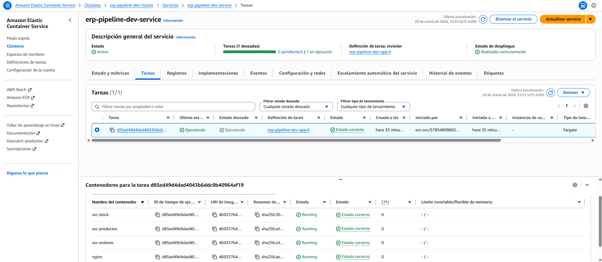
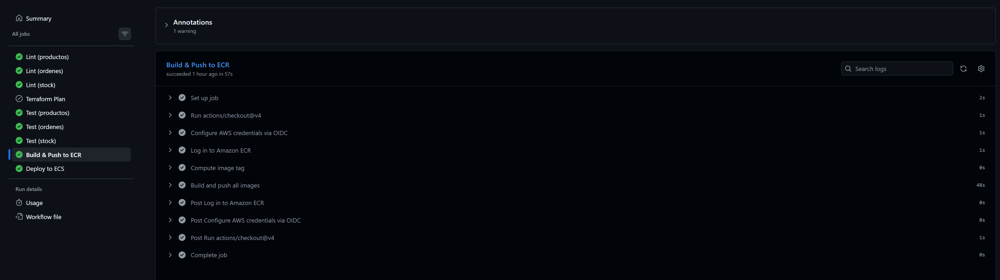
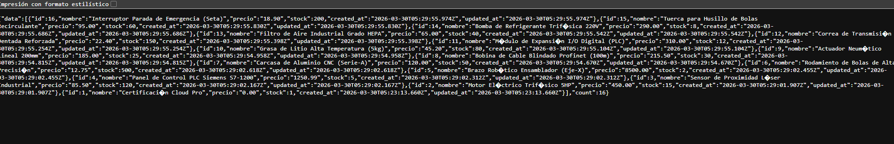
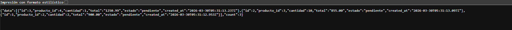
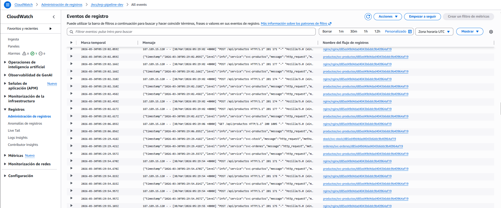

# ERP Pipeline — Cloud Native Microservices, CI/CD with IaC, Secrets Management

## Project Overview

This project is a microservices-based ERP for manufacturing, built with Node.js and deployed on AWS ECS Fargate. It focuses on a cost-efficient architecture (FinOps), automated deployments, and secure secrets management.

---

## Tech Stack

*   **Infrastructure:** AWS (ECS Fargate, RDS PostgreSQL, ECR, SSM Parameter Store, CloudWatch, SNS).
*   **IaC:** Terraform (Modular and highly scalable architecture).
*   **CI/CD:** GitHub Actions (Lint → Test → Build → Deploy).
*   **Backend:** Node.js (Express), PostgreSQL 15.
*   **Proxy:** NGINX (Sidecar Pattern).

---

## Solution Architecture

The architecture uses a **Sidecar Pattern** with NGINX to handle routing between microservices within a single ECS task. This eliminates the need for an Application Load Balancer (ALB), keeping the project within the AWS Free Tier.

### Component Diagram

**Traffic Flow:** Internet → ECS Public IP :80 → NGINX → Microservices on `localhost`.
*(No ALB or NAT Gateway — See [ADR-001](docs/adr/ADR-001-public-subnets-no-nat-gateway.md))*

### Infrastructure Status
The following screenshot confirms the ECS Fargate tasks running correctly in the AWS Console, hosting the NGINX sidecar and the three microservices.

---

## Security

- **Zero-Trust Identity:** Authentication via **OpenID Connect (OIDC)** between GitHub and AWS. Long-lived Access Keys were completely eliminated; GitHub assumes a temporary IAM role for deployment.
- **Runtime Secrets:** Secrets (like `DATABASE_URL`) are not stored in code or static environment variables. They are injected at runtime from **AWS SSM Parameter Store**.
- **VPC Isolation:** The RDS database is protected by a Security Group that **only accepts traffic** from the microservices cluster, blocking all direct external access.
- **SSL/TLS Enforcement:** Communication with RDS is encrypted in transit, with Node.js clients configured to require SSL in production environments.

---

## FinOps: $0 Cost Strategy

Optimized the infrastructure to run enterprise-grade services with a fixed cost of **$0 USD**.

| Technical Decision | Monthly Savings | Traditional Alternative |
| :--- | :--- | :--- |
| **Public Subnets + SG** | ~$32.00 | NAT Gateway |
| **NGINX Sidecar** | ~$16.00 | Application Load Balancer (ALB) |
| **SSM Parameter Store** | ~$0.40/secret | AWS Secrets Manager |
| **Total Saved** | **~$48.40/mo** | |

---

## CI/CD Pipeline & Resilience

The GitHub Actions pipeline ensures that broken code never reaches production:

1.  **Lint & Test:** Code is linted and tested against a real PostgreSQL container.
2.  **Containerize:** Images are built and pushed to AWS ECR.
3.  **Deploy:** The ECS service is updated with the new task definition. ECS's deployment circuit breaker handles automatic rollbacks if health checks fail.

---

## Sample API Output

The system comes with industrial seed data (BOM). Below are examples of the JSON responses from the microservices.

| Products API (`/api/productos`) | Orders API (`/api/ordenes`) |
| :---: | :---: |
|  |  |

---

## Monitoring

Application logs and performance metrics are centralized in CloudWatch.

---

## Troubleshooting: Lessons Learned

### 1. Resolving RDS SSL Issues
**Problem:** When connecting services to RDS, requests failed due to protocol errors because AWS RDS requires SSL/TLS by default.
**Solution:** Implemented an auto-detection logic in the `pg` driver. If the database host is an AWS endpoint (`amazonaws.com`), we enforce `ssl: { rejectUnauthorized: false }`. This ensures security in transit without the complexity of managing local certificates during CI.

### 2. Database Password Sanitization
**Problem:** Randomly generated passwords containing URI-delimiters (like `@`, `:`, `/`) corrupted the `DATABASE_URL` string, causing `ERR_INVALID_URL` in the Node.js runtime.
**Solution:** Refined the Terraform `random_password` resource to exclude conflictive special characters while maintaining high entropy, ensuring the resulting connection string remains a valid URI without requiring complex encoding logic.

---

## Quick Start (Local Dev)

To run the entire stack locally for development:
1. Clone the repo.
2. Ensure Docker is running.
3. Execute: `docker compose up --build`
4. Access the API at `http://localhost:80/api/productos`.

