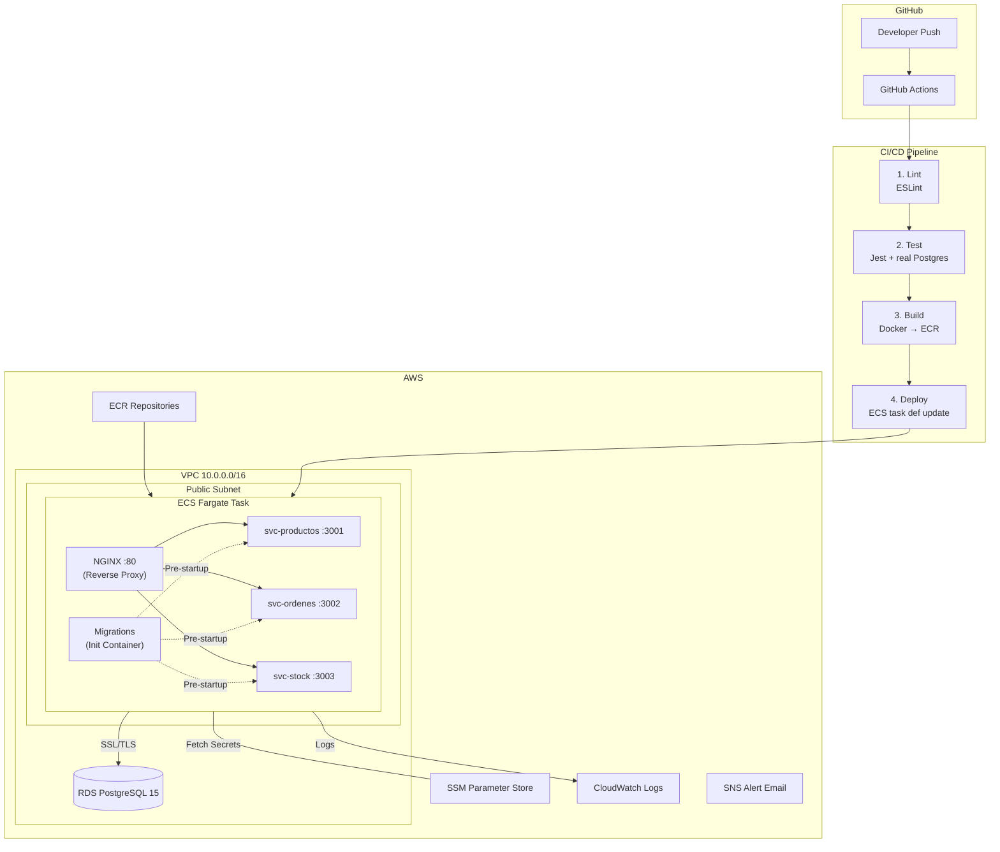

# ERP Pipeline — Cloud Native Microservices, CI/CD with IaC, Secrets Management


## Project Overview

This project is a microservices-based ERP for manufacturing, built with Node.js and deployed on AWS ECS Fargate. It focuses on a cost-efficient architecture (FinOps), automated deployments, and secure secrets management.

---

## Tech Stack

- **Infrastructure:** AWS (ECS Fargate, RDS PostgreSQL, ECR, SSM Parameter Store, CloudWatch, SNS).
- **IaC:** Terraform (Modular and highly scalable architecture).
- **CI/CD:** GitHub Actions (Lint → Test → Build → Deploy).
- **Backend:** Node.js (Express), PostgreSQL 15.
- **Proxy:** NGINX (Sidecar Pattern).

---

## Solution Architecture

The architecture uses a **Sidecar Pattern** with NGINX to handle routing between microservices within a single ECS task. This eliminates the need for an Application Load Balancer (ALB), keeping the project within the AWS Free Tier.

### Component Diagram


```mermaid
graph TB
    subgraph GitHub
        DEV[Developer Push] --> GHA[GitHub Actions]
    end

    subgraph Pipeline["CI/CD Pipeline"]
        GHA --> L[1. Lint\nESLint]
        L --> T[2. Test\nJest + real Postgres]
        T --> B[3. Build\nDocker → ECR]
        B --> D[4. Deploy\nECS task def update]
    end

    subgraph AWS
        subgraph VPC["VPC 10.0.0.0/16"]
            subgraph PubSubnet["Public Subnet"]
                subgraph Task["ECS Fargate Task"]
                    NGX["NGINX :80\n(Reverse Proxy)"]
                    MIG["Migrations\n(Init Container)"]
                    P["svc-productos :3001"]
                    O["svc-ordenes :3002"]
                    S["svc-stock :3003"]
                end
            end
            RDS[("RDS PostgreSQL 15")]
        end

        ECR["ECR Repositories"]
        SSM["SSM Parameter Store"]
        CW["CloudWatch Logs"]
        SNS["SNS Alert Email"]
    end

    NGX --> P & O & S
    MIG -. "Pre-startup" .-> P & O & S
    Task -- "SSL/TLS" --> RDS
    Task -- "Fetch Secrets" --- SSM
    Task -- "Logs" --> CW
    ECR --> Task
    D --> Task
```

**Traffic Flow:** Internet → ECS Public IP :80 → NGINX → Microservices on `localhost`.
_(No ALB or NAT Gateway — See [ADR-001](docs/adr/ADR-001-public-subnets-no-nat-gateway.md))_

### Infrastructure Status

The following screenshot confirms the ECS Fargate tasks running correctly in the AWS Console, hosting the NGINX sidecar and the three microservices.


---

## Security

- **Zero-Trust Identity:** Authentication via **OpenID Connect (OIDC)** between GitHub and AWS. Long-lived Access Keys were completely eliminated; GitHub assumes a temporary IAM role for deployment.
- **Runtime Secrets:** Secrets (like `DATABASE_URL`) are not stored in code or static environment variables. They are injected at runtime from **AWS SSM Parameter Store**.
- **VPC Isolation:** The RDS database is protected by a Security Group that **only accepts traffic** from the microservices cluster, blocking all direct external access.
- **SSL/TLS Enforcement:** Communication with RDS is encrypted in transit, with Node.js clients configured to require SSL in production environments.

---

## FinOps: $0 Cost Strategy

Optimized the infrastructure to run enterprise-grade services with a fixed cost of **$0 USD**.

| Technical Decision      | Monthly Savings | Traditional Alternative         |
| :---------------------- | :-------------- | :------------------------------ |
| **Public Subnets + SG** | ~$32.00         | NAT Gateway                     |
| **NGINX Sidecar**       | ~$16.00         | Application Load Balancer (ALB) |
| **SSM Parameter Store** | ~$0.40/secret   | AWS Secrets Manager             |
| **Total Saved**         | **~$48.40/mo**  |                                 |

---

## CI/CD Pipeline & Resilience (Fase 6)

The GitHub Actions pipeline (`pipeline.yml:18-711`) ensures broken code never reaches production — fast, cheap and auditable (`<6m` en PR):


| Stage              | Jobs                                             | Qué hace                                                                                                                                                                                 | Cache / skip                                               |
| ------------------ | ------------------------------------------------ | ---------------------------------------------------------------------------------------------------------------------------------------------------------------------------------------- | ---------------------------------------------------------- |
| **Concurrency**    | `concurrency: group workflow-ref`                | cancela runs obsoletos del mismo branch                                                                                                                                                  | —                                                          |
| **Detect changes** | `changes` (`dorny/paths-filter@v3`)              | determina `productos/ordenes/stock/nginx/migrations/terraform` cambiados                                                                                                                 | —                                                          |
| **Lint & Format**  | `lint` matrix + `format`                         | `eslint --cache` por servicio (`.eslintcache` en `actions/cache@v4`) + `prettier --check`                                                                                                | eslint cache + npm cache                                   |
| **Secrets**        | `gitleaks`                                       | `gitleaks/gitleaks-action@v2` full history                                                                                                                                               | —                                                          |
| **Vuln FS**        | `trivy-fs`                                       | `aquasecurity/trivy-action` `fs` `HIGH,CRITICAL` → SARIF → code scanning                                                                                                                 | —                                                          |
| **Test**           | `test` matrix (postgres:15)                      | `jest --coverage` por servicio + `migrations/run.js` previo + `upload-artifact coverage-*`                                                                                               | npm cache por `package-lock.json`                          |
| **e2e**            | `e2e`                                            | `docker compose up --build --wait` + `scripts/e2e.sh` (nginx→servicios)                                                                                                                  | —                                                          |
| **Infra**          | `terraform` (solo PR)                            | `fmt -check` → `init -backend=false` → `validate` → `tflint --init/--recursive` → `checkov` (SARIF) → `init` con backend OIDC → `plan` → comment `sticky-pull-request-comment` + summary | —                                                          |
| **Build**          | `build` (solo `push main` + `any_service==true`) | `docker/setup-buildx-action@v3` + `docker/build-push-action@v6` por servicio **cambiado** con `cache-from/to: type=gha,mode=max` → ECR `:sha-<short>` + `:latest`                        | `type=gha` (~60% layer hit) + skip si `paths-filter` false |
| **Vuln image**     | `trivy-image` matrix                             | `trivy image` sobre ECR `CRITICAL,HIGH` (soft-fail) → SARIF                                                                                                                              | —                                                          |
| **Deploy**         | `deploy`                                         | `scripts/deploy.sh` swap JSON + `aws ecs wait services-stable` (circuit breaker `rollback=true` en `compute/main.tf:375`)                                                                | —                                                          |

**Resiliencia deploy:** `deployment_circuit_breaker { rollback=true }` + `deploy.sh` verifica digest. Si `health` falla, ECS vuelve al TaskDef previo sin intervención.

---

## Sample API Output

The system comes with industrial seed data (BOM). Below are examples of the JSON responses from the microservices.

|                 Products API (`/api/productos`)                 |                 Orders API (`/api/ordenes`)                 |
| :-------------------------------------------------------------: | :---------------------------------------------------------: |
|  |  |

---

## Monitoring

Application logs and performance metrics are centralized in CloudWatch.


---

## Troubleshooting: Lessons Learned

### 1. Resolving RDS SSL Issues

**Problem:** When connecting services to RDS, requests failed due to protocol errors because AWS RDS requires SSL/TLS by default.
**Solution:** Implemented an auto-detection logic in the `pg` driver. If the database host is an AWS endpoint (`amazonaws.com`), we enforce `ssl: { rejectUnauthorized: false }`. This ensures security in transit without the complexity of managing local certificates during CI.

### 2. Database Password Sanitization

**Problem:** Randomly generated passwords containing URI-delimiters (like `@`, `:`, `/`) corrupted the `DATABASE_URL` string, causing `ERR_INVALID_URL` in the Node.js runtime.
**Solution:** Refined the Terraform `random_password` resource to exclude conflictive special characters while maintaining high entropy, ensuring the resulting connection string remains a valid URI without requiring complex encoding logic.

---

## Quick Start (Local Dev) — Fase 2: compose + monorepo

Prerrequisitos: Node 20 (`.nvmrc:1`), Docker + compose v2.

```bash
git clone <repo> && cd Pipeline_CI-CD_IaC
cp .env.example .env        # opcional: ajusta POSTGRES_PASSWORD
nvm use                     # o fnm/asdf — lee .tool-versions:1
npm install                 # workspaces: root + services/* + packages/*

# Opción A: Makefile (recomendado)
make dev                    # docker compose up --build con hot-reload (override)
# Opción B: script
./scripts/dev.sh up
# Opción C: directo
docker compose up --build
```

- **Hot-reload:** `docker-compose.override.yml:12-62` monta `services/*/src` + `packages/shared/src` y usa `npm run dev` (nodemon). Edita `services/productos/src/routes/productos.js` y recarga sin rebuild.
- **Prod-like sin hot-reload:** `make prod` o `docker compose -f docker-compose.yml up --build`
- **Logs/ps:** `make logs` / `make ps` o `./scripts/dev.sh logs`
- **Reset DB:** `make nuke` (borra `pgdata`)

**Endpoints (vía NGINX en compose):**

```bash
curl http://localhost:80/health
curl http://localhost:80/api/productos/health
curl http://localhost:80/api/ordenes/health
curl http://localhost:80/api/stock/health
curl http://localhost:80/api/productos | jq
```

**Troubleshooting local:**

| Síntoma                                   | Causa                                                         | Fix                                                                                                                |
| ----------------------------------------- | ------------------------------------------------------------- | ------------------------------------------------------------------------------------------------------------------ |
| `migrations` exit 1                       | `DATABASE_URL` mal o postgres no healthy                      | `docker compose logs postgres` + `docker compose logs migrations`                                                  |
| `productos` health 500 `db: disconnected` | `postgres` no listo o `DATABASE_URL` apunta a host equivocado | Verifica `.env` usa `postgres:5432` (no `localhost`) dentro de compose                                             |
| `nginx` 502                               | upstreams no resuelven                                        | En compose se usa `nginx/nginx.local.conf:28-30` (`productos:3001`), no `127.0.0.1`; no montar `nginx.conf` de ECS |
| `require('@erp/shared')` not found        | workspaces no instalados                                      | `npm install` en root; verifica `node_modules/@erp/shared/src/logger.js` existe                                    |
| `eslint import/order`                     | grupos sin línea vacía                                        | `npm run lint:fix`                                                                                                 |

> Arquitectura local vs ECS: compose usa `upstreams productos:3001` (DNS Docker) vs ECS `127.0.0.1:3001` (awsvpc sidecar). Ver `docs/ARCHITECTURE.md:1` y `nginx/nginx.local.conf:1`.

**Comandos útiles:**

```bash
make verify   # lint + format-check + compose config + terraform fmt -check
make lint && make format-check
docker compose config -q && echo "compose ok"
```
