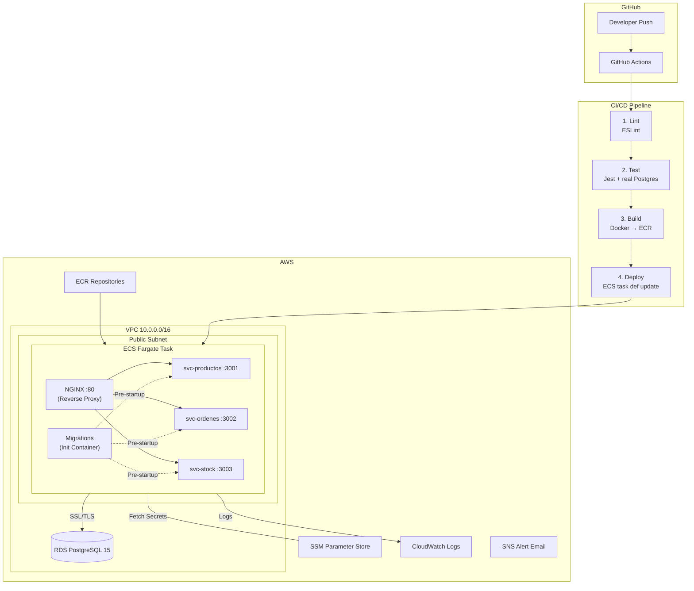
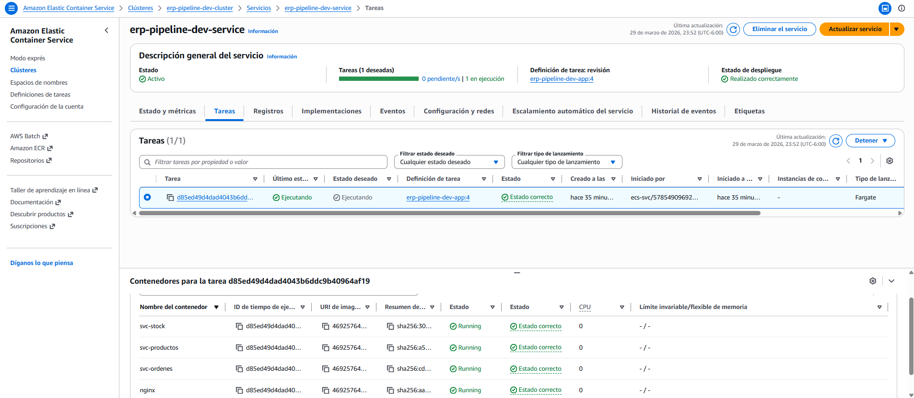
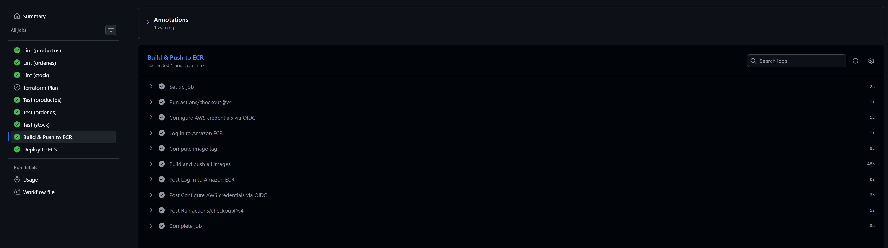
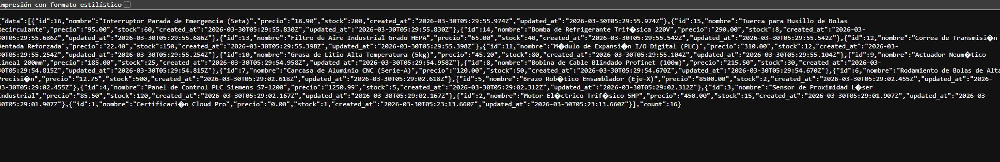
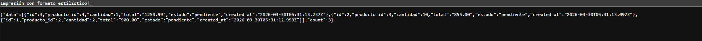
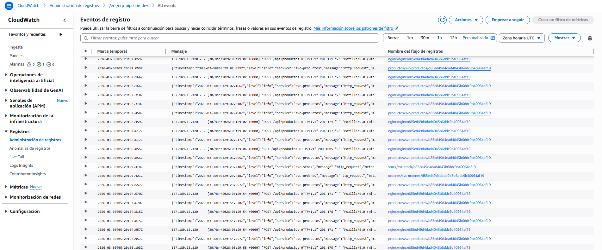

# ERP Pipeline — Cloud Native Microservices, CI/CD with IaC, Secrets Management


## Project Overview

This project is a microservices-based ERP for manufacturing, built with Node.js and deployed on AWS ECS Fargate. It focuses on a cost-efficient architecture (FinOps), automated deployments, and secure secrets management.

---

## Tech Stack

- **Infrastructure:** AWS (ECS Fargate, RDS PostgreSQL, ECR, SSM Parameter Store, CloudWatch, SNS).
- **IaC:** Terraform (Modular and highly scalable architecture).
- **CI/CD:** GitHub Actions (Lint → Test → Build → Deploy).
- **Backend:** Node.js (Express), PostgreSQL 15.
- **Proxy:** NGINX (Sidecar Pattern).

---

## Solution Architecture

The architecture uses a **Sidecar Pattern** with NGINX to handle routing between microservices within a single ECS task. This eliminates the need for an Application Load Balancer (ALB), keeping the project within the AWS Free Tier.

### Component Diagram


```mermaid
graph TB
    subgraph GitHub
        DEV[Developer Push] --> GHA[GitHub Actions]
    end

    subgraph Pipeline["CI/CD Pipeline"]
        GHA --> L[1. Lint\nESLint]
        L --> T[2. Test\nJest + real Postgres]
        T --> B[3. Build\nDocker → ECR]
        B --> D[4. Deploy\nECS task def update]
    end

    subgraph AWS
        subgraph VPC["VPC 10.0.0.0/16"]
            subgraph PubSubnet["Public Subnet"]
                subgraph Task["ECS Fargate Task"]
                    NGX["NGINX :80\n(Reverse Proxy)"]
                    MIG["Migrations\n(Init Container)"]
                    P["svc-productos :3001"]
                    O["svc-ordenes :3002"]
                    S["svc-stock :3003"]
                end
            end
            RDS[("RDS PostgreSQL 15")]
        end

        ECR["ECR Repositories"]
        SSM["SSM Parameter Store"]
        CW["CloudWatch Logs"]
        SNS["SNS Alert Email"]
    end

    NGX --> P & O & S
    MIG -. "Pre-startup" .-> P & O & S
    Task -- "SSL/TLS" --> RDS
    Task -- "Fetch Secrets" --- SSM
    Task -- "Logs" --> CW
    ECR --> Task
    D --> Task
```

**Traffic Flow:** Internet → ECS Public IP :80 → NGINX → Microservices on `localhost`.
_(No ALB or NAT Gateway — See [ADR-001](docs/adr/ADR-001-public-subnets-no-nat-gateway.md))_

### Infrastructure Status

The following screenshot confirms the ECS Fargate tasks running correctly in the AWS Console, hosting the NGINX sidecar and the three microservices.



---

## Security (Fase 8 hardened)

- **Zero-Trust Identity:** OIDC GitHub→AWS (`terraform/cicd.tf:17-65` `ADR-002`) — `prod` least-privilege `sub=ref:refs/heads/main` only, `dev` allows `pull_request` (`cicd.tf:56` Fase 8.5); thumbprint via `data.tls_certificate` auto-rotation (`docs/security/rotation.md:1`).
- **Runtime Secrets:** SSM `SecureString` `/erp/*/db-url` (`secrets/main.tf:23`) + IAM `GetParameter/GetParameters` + `kms:Decrypt ViaService ssm` (`secrets/main.tf:73` Fase 8.1) + rotation runbook (`docs/security/rotation.md:40`).
- **VPC Isolation:** SG `sg_db` solo `sg_app→5432` (`networking/main.tf:163`), public subnets FinOps `enable_nat_gateway=false` (Fase 7.3), WAF toggle doc `ADR-003` cuando `enable_alb=true` (Fase 8.8).
- **SSL/TLS:** RDS `rejectUnauthorized:true` en prod con CA bundle `certs/rds-ca-bundle.pem` montado en `/app/certs` (`packages/shared/src/db.js:18` + `migrations/run.js:15` Fase 8.2) — `download: curl https://truststore.pki.rds.amazonaws.com/global/global-bundle.pem`.
- **App Defense:** `helmet` + `cors` + `compression` + `express-rate-limit 100/min` + `trust proxy 1` (`packages/shared/src/middleware.js:20` + `services/*/src/index.js:14` Fase 8.3) + NGINX `limit_req_zone 30r/s burst 60 429` (`nginx.conf:14` Fase 8.4) + headers `X-Content-Type-Options/CSP/HSTS/Permissions-Policy` (`nginx.conf:36`).
- **Supply Chain:** `gitleaks` + `trivy fs/image` (`pipeline.yml:216` Fase 6.3) + `npm audit --omit=dev --audit-level=high` + `snyk` soft-fail (`pipeline.yml:180` Fase 8.7) + `checkov/tflint` 0 high (`terraform/.tflint.hcl:1`).

---

## FinOps: $0 Cost Strategy

Optimized the infrastructure to run enterprise-grade services with a fixed cost of **$0 USD**.

| Technical Decision      | Monthly Savings | Traditional Alternative         |
| :---------------------- | :-------------- | :------------------------------ |
| **Public Subnets + SG** | ~$32.00         | NAT Gateway                     |
| **NGINX Sidecar**       | ~$16.00         | Application Load Balancer (ALB) |
| **SSM Parameter Store** | ~$0.40/secret   | AWS Secrets Manager             |
| **Total Saved**         | **~$48.40/mo**  |                                 |

---

## CI/CD Pipeline & Resilience (Fase 6-8)

The GitHub Actions pipeline (`pipeline.yml:18-748`) ensures broken code never reaches production — fast, cheap and auditable (`<6m` en PR):



| Stage              | Jobs                                             | Qué hace                                                                                                                                                                                                                                                                            | Cache / skip                                               |
| ------------------ | ------------------------------------------------ | ----------------------------------------------------------------------------------------------------------------------------------------------------------------------------------------------------------------------------------------------------------------------------------- | ---------------------------------------------------------- |
| **Concurrency**    | `concurrency: group workflow-ref`                | cancela runs obsoletos del mismo branch (`pipeline.yml:38` Fase 6.1) + `teardown` `teardown-ref` (Fase 7.8)                                                                                                                                                                         | —                                                          |
| **Detect changes** | `changes` (`dorny/paths-filter@v3`)              | determina `productos/ordenes/stock/nginx/migrations/terraform` cambiados (`pipeline.yml:58` Fase 6.7)                                                                                                                                                                               | —                                                          |
| **Lint & Format**  | `lint` matrix + `format`                         | `eslint --cache` por servicio (`.eslintcache` en `actions/cache@v4`) + `prettier --check` (`pipeline.yml:114` Fase 6.5)                                                                                                                                                             | eslint cache + npm cache                                   |
| **Audit**          | `audit` matrix (`productos/ordenes/stock`)       | `npm audit --audit-level=high --omit=dev` prod only + `snyk/actions/node` soft-fail (`pipeline.yml:180` Fase 8.7)                                                                                                                                                                   | npm cache                                                  |
| **Secrets**        | `gitleaks`                                       | `gitleaks/gitleaks-action@v2` full history (`pipeline.yml:216` Fase 6.3)                                                                                                                                                                                                            | —                                                          |
| **Vuln FS**        | `trivy-fs`                                       | `aquasecurity/trivy-action` `fs` `HIGH,CRITICAL` → SARIF → code scanning (`pipeline.yml:230` Fase 6.3)                                                                                                                                                                              | —                                                          |
| **Test**           | `test` matrix (postgres:15)                      | `jest --coverage` por servicio + `migrations/run.js` previo + `upload-artifact coverage-*` (`pipeline.yml:242` Fase 6.6)                                                                                                                                                            | npm cache por `package-lock.json`                          |
| **e2e**            | `e2e`                                            | `docker compose up --build --wait` + `scripts/e2e.sh` (nginx→servicios) (`pipeline.yml:310` Fase 4.8)                                                                                                                                                                               | —                                                          |
| **Infra**          | `terraform` (solo PR)                            | `fmt -check` → `init -backend=false` → `validate` → `tflint --init/--recursive` (`terraform/.tflint.hcl:1` Fase 6.4) → `checkov` SARIF → `init -reconfigure -backend-config=environments/backend-dev.hcl` → `plan -var-file=environments/dev.tfvars` → comment + summary (Fase 7.1) | —                                                          |
| **Build**          | `build` (solo `push main` + `any_service==true`) | `docker/setup-buildx-action@v3` + `docker/build-push-action@v6` per-service `if: productos==true` `cache-from/to: type=gha,mode=max` → ECR `:sha-<short>` + `:latest` (`pipeline.yml:467` Fase 6.2+6.7)                                                                             | `type=gha` (~60% layer hit) + skip si `paths-filter` false |
| **Vuln image**     | `trivy-image` matrix                             | `trivy image` ECR `CRITICAL,HIGH` soft-fail → SARIF (`pipeline.yml:619` Fase 6.3)                                                                                                                                                                                                   | —                                                          |
| **Deploy**         | `deploy`                                         | `scripts/deploy.sh:1` hardened `flock` + `ecr describe-images` digest + `register` verify + `wait services-stable` + rollback detect (`pipeline.yml:679` Fase 7.7)                                                                                                                  | —                                                          |

**Resiliencia deploy:** `deployment_circuit_breaker { rollback=true }` (`compute/main.tf:375`) + `deploy.sh` lock+digest. Si `health` falla, ECS vuelve al TaskDef previo. **Seguridad:** `checkov -d terraform 0 high fails` + `npm audit --omit=dev 0 high` + headers `curl -I` `X-Content-Type-Options: nosniff` (`nginx.conf:36` Fase 8.4).

---

## Sample API Output

The system comes with industrial seed data (BOM). Below are examples of the JSON responses from the microservices.

|                 Products API (`/api/productos`)                 |                 Orders API (`/api/ordenes`)                 |
| :-------------------------------------------------------------: | :---------------------------------------------------------: |
|  |  |

---

## Monitoring & Observability (Fase 9)

Logs, métricas, traces y health sin `ssh` — ver `docs/observability.md:1` y `terraform/dashboard.tf:10`:

- **Logs:** JSON `requestId` (`logger.js:14` `AsyncLocalStorage` + `middleware.js:12` `enterWith`) → CloudWatch `/ecs/erp-pipeline-{env}` `retention 7d dev / 90d prod` (`compute/main.tf:110`). Queries Insights `filter level=error | stats by service` + `filter requestId=xxx`.
- **Métricas:** `prom-client` `http_request_duration_ms` histogram + `http_requests_total` (`metrics.js:20`) + EMF `HttpLatency` → CloudWatch Metrics `erp-pipeline/{env}` + `GET /metrics` (`services/productos/src/index.js:14` + `nginx.conf:45`).
- **Dashboard:** 6 widgets CPU/Mem/Error/Latency p95/5xx/DB conns + log table (`dashboard.tf:10`) `erp-pipeline-{env}-overview` `$3/mes`.
- **Alarmas:** `ServiceErrorCount>10/5m` + `p95>500ms` + `5xx>10/5m` + `DBConnections>80` → SNS `alert_email` (`observability.tf:49`).
- **Tracing:** OTel `NodeSDK` + `auto-instrumentations` + `OTLPTraceExporter` `OTEL_ENABLED=true` → `http://localhost:4318/v1/traces` (`tracing.js:20`).
- **Health:** `/health/details` `pool {totalCount,idleCount,waitingCount}` + `uptime` + `memory` (`health.js:60`).

 _→ ahora con dashboard Fase 9 + Insights_

---

## Scale & Resilience (Fase 10)

FinOps **$0 dev** (toggles false) → Prod toggle sin reescribir — ver `docs/adr/ADR-004-scaling-strategy.md:1` y `terraform/variables.tf:80`:

- **Decoupling:** `ordenes → productos` via HTTP `PRODUCTOS_URL` (`http://productos.erp.local:3001` con Cloud Map `erp.local` o `http://productos:3001` en compose) + `CircuitBreaker` (`circuitBreaker.js:1` `CLOSED→OPEN→HALF_OPEN` failureThreshold 5) + fallback `SELECT 1` DB + `GET /productos/:id` (`productos.js:40`). `GET /ordenes/_circuit` stats solo dev.
- **Stock TX:** `POST /stock` `BEGIN; SELECT … FOR UPDATE; INSERT movimientos; COMMIT` (`stock.js:42`) + trigger `005_stock_invariant.sql:6` `409 STOCK_CONFLICT` si `stock insuficiente` + invalida cache.
- **Cache:** `GET /productos?cache` `ioredis` `REDIS_URL=redis://redis:6379` (`cache.js:1` memory fallback) + `X-Cache HIT/MISS` header (`productos.js:15` `CACHE_TTL=30` + `del productos:list:*`). `docker-compose.yml:9` `redis:7-alpine` healthcheck; `cache.tf:1` ElastiCache `cache.t3.micro` toggle `enable_redis` (~$12/mes).
- **Queue:** `POST /ordenes` → `publishOrdenCreada` (`queue.js:1` `@aws-sdk/client-sqs` si `SQS_QUEUE_URL` else `queue_publish_noop`) + `sqs.tf:1` `ordenes` + DLQ toggle `enable_sqs` ($0.40/M). `POLL_SQS=true` consumer opcional.
- **ALB:** toggle `enable_alb` (`compute/main.tf:320` `aws_lb` + `target_group` `ip:80 /health` + `listener 80/443 ACM`) + SG `sg_alb` + `dynamic load_balancer nginx:80` (`main.tf:241`) — dev `false` ($0 nginx sidecar), prod `true` (~$16/mes) requiere `enable_nat_gateway=true` (private subnets).
- **Autoscaling:** toggle `enable_autoscaling` (`compute/main.tf:296` `aws_appautoscaling_target 1-4` + `policy cpu 70%` + `memory 80%` + `desired_count = min`). Prod `min 2` HA.
- **Chaos:** `scripts/chaos.sh:1` kill-productos (circuit fallback 404), cache HIT→MISS, stock 409 + `scripts/k6/resilience.js:1` 50 rps p95<300ms p99<500ms fail<1%.

```bash
# Local con cache+circuit
docker compose up --build -d --wait
curl -i http://localhost:80/api/v1/productos?limit=1 | grep X-Cache # MISS → HIT
curl http://localhost:80/api/v1/productos/1 | jq
PRODUCTOS_URL=http://productos:3001 curl -s http://localhost:80/api/v1/ordenes/_circuit | jq
./scripts/chaos.sh http://localhost:80 all
k6 run scripts/k6/resilience.js -e BASE_URL=http://localhost:80
# Prod toggle (requiere NAT)
terraform -chdir=terraform apply -var-file=environments/prod.tfvars # enable_alb=true enable_redis=true ...
```

Coste prod full Fase 10: ALB $16 + NAT $32 + Redis $12 + SQS $0.40 + dashboard $3 = ~$64 vs dev $0 (toggles false).

---

## Demo & Portfolio Polish (Fase 11)

**2m demo:** `docs/demo.md:1` + `frontend/` + `docs/interview.md:1`

- **Frontend:** `frontend/index.html` static dashboard (Fase 11.2) consume `GET /api/v1/...` → `http://localhost:80` (compose) o `http://<alb-dns>` prod. Health + `X-Cache` + BFF `GET /api/v1/ordenes/:id?include=producto` + `POST stock 409` + `/metrics` links. Run: `npx serve frontend -l 8080` o `docker compose --profile frontend up` → `http://localhost:8080`. Gateway opcional `docker compose --profile gateway up` → `GET /api/v1/bff/ordenes/:id` (`services/gateway/src/index.js:1`).
- **BFF:** `GET /api/v1/ordenes/:id?include=producto` (`services/ordenes/src/routes/ordenes.js:152` Fase 11.1) agrega producto via `CircuitBreaker` + `GET /api/v1/bff/ordenes/:id` en `svc-gateway` (`nginx.conf:102` `nginx.local.conf:88`).
- **Demo gif:** `docs/screenshots/demo.gif` 800x450 <5MB (peek/LICEcap) + screenshots refresh `aws_console.png`/`cloudwatch.png`/`github_actions.png` (Fase 11.3).
- **API Contract:** `docs/openapi.yaml:1` OpenAPI 3.1 + `docs/api.md:1` BFF include, pagination, `AppError` (`ADR-006`).
- **Release:** `semantic-release` + `CHANGELOG.md:1` + tags `v1.x` (`package.json:11` + `.releaserc.json:1` Fase 11.6).
- **Interview:** `docs/interview.md:1` 17 Q&A rollback, FinOps, decoupling, cache, BFF, WAF.

```bash
git clone https://github.com/Francisco-cor/Pipeline_CI-CD_IaC && cd Pipeline_CI-CD_IaC
cp .env.example .env && nvm use && npm install
docker compose up --build -d --wait && docker compose --profile frontend up -d --build
open http://localhost:8080
curl "http://localhost:80/api/v1/ordenes/1?include=producto" | jq
curl "http://localhost:80/api/v1/bff/ordenes/1" | jq  # con gateway profile
```

---

## Troubleshooting: Lessons Learned

### 1. Resolving RDS SSL Issues

**Problem:** When connecting services to RDS, requests failed due to protocol errors because AWS RDS requires SSL/TLS by default.
**Solution:** Implemented an auto-detection logic in the `pg` driver. If the database host is an AWS endpoint (`amazonaws.com`), we enforce `ssl: { rejectUnauthorized: false }`. This ensures security in transit without the complexity of managing local certificates during CI.

### 2. Database Password Sanitization

**Problem:** Randomly generated passwords containing URI-delimiters (like `@`, `:`, `/`) corrupted the `DATABASE_URL` string, causing `ERR_INVALID_URL` in the Node.js runtime.
**Solution:** Refined the Terraform `random_password` resource to exclude conflictive special characters while maintaining high entropy, ensuring the resulting connection string remains a valid URI without requiring complex encoding logic.

---

## Quick Start (Local Dev) — Fase 2: compose + monorepo

Prerrequisitos: Node 20 (`.nvmrc:1`), Docker + compose v2.

```bash
git clone <repo> && cd Pipeline_CI-CD_IaC
cp .env.example .env        # opcional: ajusta POSTGRES_PASSWORD
nvm use                     # o fnm/asdf — lee .tool-versions:1
npm install                 # workspaces: root + services/* + packages/*

# Opción A: Makefile (recomendado)
make dev                    # docker compose up --build con hot-reload (override)
# Opción B: script
./scripts/dev.sh up
# Opción C: directo
docker compose up --build
```

## Infra Multi-Env (Fase 7)

Terraform escala `dev/staging/prod` sin copy-paste (`terraform/environments/`):

```bash
# Backend por env (S3 + DynamoDB lock) — crear una vez
./scripts/bootstrap-backend.sh erp-pipeline dev us-east-2
./scripts/bootstrap-backend.sh erp-pipeline prod us-east-2

# Dev (FinOps $0 — public subnets, sin NAT, deletion_protection=false)
terraform -chdir=terraform init -backend-config=environments/backend-dev.hcl
terraform -chdir=terraform plan -var-file=environments/dev.tfvars
terraform -chdir=terraform apply -var-file=environments/dev.tfvars

# Prod (HA — multi_az=true, backup 7d, deletion_protection=true, gp3 encrypted)
terraform -chdir=terraform init -reconfigure -backend-config=environments/backend-prod.hcl
terraform -chdir=terraform plan -var-file=environments/prod.tfvars
# Ver diff sin tocar dev: plan prod no debe afectar dev (Fase 7 métrica)

# Toggles (Fase 7.3/7.6 + 10) en tfvars — default FinOps, prod toggle documentado:
#   enable_nat_gateway=false         # → true crea private subnets + NAT (~$32/mes) + EIP
#   enable_service_discovery=false   # → true crea Cloud Map erp.local (productos.erp.local:3001)
#   ecr_image_retention_count=5      # → 5 imágenes para rollback (Fase 7.5) vs 1 peligroso
#   enable_alb=false                 # → true crea ALB + TG + listener (~$16/mes) Fase 10.4
#   enable_autoscaling=false         # → true CPU 70% scale 1-4 Fase 10.3
#   enable_redis=false               # → true ElastiCache t3.micro (~$12/mes) Fase 10.5
#   enable_sqs=false                 # → true SQS ordenes+DLQ ($0.40/M) Fase 10.6
```

- **TaskDef templated:** `terraform/modules/compute/templates/taskdef.json.tftpl:1` via `templatefile` en `compute/main.tf:155-200` (Fase 7.4) — separa infra de contenedores.
- **Teardown guard:** `teardown.yml:15-60` bloquea `prod` (`if: environment != prod`) + requiere `confirm=destroy` + GitHub Environment `destroy` para aprobación manual (Fase 7.8).
- **Runbooks:** `docs/runbooks/deploy.md:1`, `rollback.md:1`, `drift.md:1` (Fase 7.9) — cómo deployar, rollback por circuit breaker y detectar drift.

- **Hot-reload:** `docker-compose.override.yml:12-62` monta `services/*/src` + `packages/shared/src` y usa `npm run dev` (nodemon). Edita `services/productos/src/routes/productos.js` y recarga sin rebuild.
- **Prod-like sin hot-reload:** `make prod` o `docker compose -f docker-compose.yml up --build`
- **Logs/ps:** `make logs` / `make ps` o `./scripts/dev.sh logs`
- **Reset DB:** `make nuke` (borra `pgdata`)

**Endpoints (vía NGINX en compose):**

```bash
curl http://localhost:80/health
curl http://localhost:80/api/productos/health
curl http://localhost:80/api/ordenes/health
curl http://localhost:80/api/stock/health
curl http://localhost:80/api/productos | jq
```

**Troubleshooting local:**

| Síntoma                                   | Causa                                                         | Fix                                                                                                                |
| ----------------------------------------- | ------------------------------------------------------------- | ------------------------------------------------------------------------------------------------------------------ |
| `migrations` exit 1                       | `DATABASE_URL` mal o postgres no healthy                      | `docker compose logs postgres` + `docker compose logs migrations`                                                  |
| `productos` health 500 `db: disconnected` | `postgres` no listo o `DATABASE_URL` apunta a host equivocado | Verifica `.env` usa `postgres:5432` (no `localhost`) dentro de compose                                             |
| `nginx` 502                               | upstreams no resuelven                                        | En compose se usa `nginx/nginx.local.conf:28-30` (`productos:3001`), no `127.0.0.1`; no montar `nginx.conf` de ECS |
| `require('@erp/shared')` not found        | workspaces no instalados                                      | `npm install` en root; verifica `node_modules/@erp/shared/src/logger.js` existe                                    |
| `eslint import/order`                     | grupos sin línea vacía                                        | `npm run lint:fix`                                                                                                 |

> Arquitectura local vs ECS: compose usa `upstreams productos:3001` (DNS Docker) vs ECS `127.0.0.1:3001` (awsvpc sidecar). Ver `docs/ARCHITECTURE.md:1` y `nginx/nginx.local.conf:1`.

**Comandos útiles:**

```bash
make verify   # lint + format-check + compose config + terraform fmt -check
make lint && make format-check
docker compose config -q && echo "compose ok"
```
